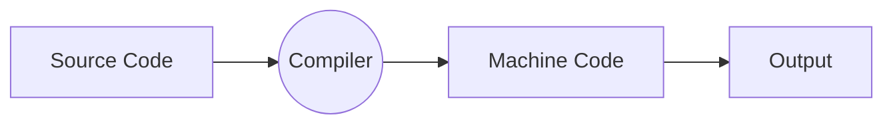
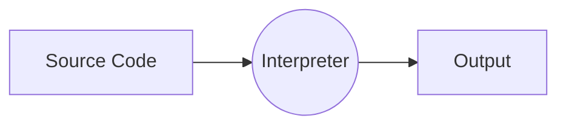
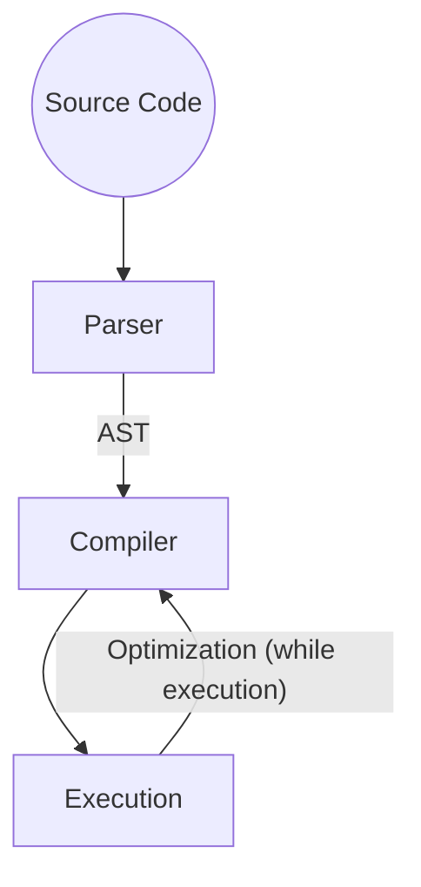
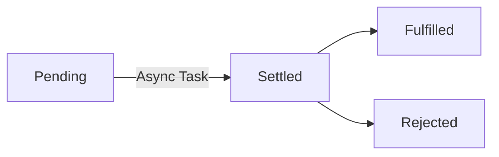

## VS Code

**Code Editor**: VS Code with Monokai Pro Theme and File icon theme to Seti.

**VS Code Editor Settings:**
1. AutoSave -> onFocusChange
2. Multi cursor modifier -> alt
3. FormatOnSave -> turn on

**VS Code Extensions:**

**Prettier - Code formatter**
set prettier to as a default formatter and format on save is also enabled.
Overriding default values of Prettier:
STEP 01: Create a file named `.prettierrc`
STEP 02: Edit a file
```js
{
  "singleQuote": true
}
```
The above lines convert any double quotes to single quotes.

**User Snippets**
Create a user snippets for repeated function usage.

**Auto Rename Tag**: for auto renaming of tags if changed.

**Image Preview**

NPM Install for Live Server
`npm install live-server -g`
run using cmd: `live-server`
## Best Practices

* Use `const` declaration mostly.
* Declare string not in double quotation rather in back ticks ``.


## Strict Mode

Strict mode makes several changes to normal JavaScript semantics:

1. Eliminates some JavaScript silent errors by changing them to throw errors.
2. Fixes mistakes that make it difficult for JavaScript engines to perform optimizations: strict mode code can sometimes be made to run faster than identical code that's not strict mode.
3. Prohibits some syntax likely to be defined in future versions of ECMAScript.

Activate strict mode

```js
'use strict';
```


## A Brief Intro

JavaScript is a high level, object oriented, multi-paradigm programming language.

**ECMAScript** is **a standard for scripting languages, including JavaScript, JScript, and ActionScript**. It is best known as a JavaScript standard intended to ensure the interoperability of web pages across different web browsers.

Modern JavaScript - from ESMA 2015 and so on. Modern JavaScript Engine has backward compatible. They believe in the principle of **"Don't break the Web"**.

* Old features never removed.
* They provide just incremental updates.
* Website keep working forever.

**Babel** is a free and open-source JavaScript transcompiler that is mainly used to convert ECMAScript 2015+ code into backwards-compatible JavaScript code that can be run by older JavaScript engines. It allows web developers to take advantage of the newest features of the language

**Polyfilling** and **transpiling** are essential strategies in modern web development that provide distinct challenges. **Polyfilling addresses absent features in older browsers while transpiling streamlines code for cross-version harmony**. Both techniques contribute to a seamless and up-to-date web development landscape.

**Webpack and Parcel** is a tool that **lets you bundle your JavaScript applications** (supporting both ESM and CommonJS).

## Linking JS files

`script.js`
```js
let js = "Amazing";
if(js === 'Amazing'){
    alert("JavaScript is Amazing");
}
console.log("Hello");
```
`index.html`
```html
<!DOCTYPE html>
<body>
</body>
<script src="script.js"></script>
</html>
```
## Variables

The only two special case character we can use while declaring variables.

```js
let $firstName = "Sandeep"
let _firstName = "Sandeep"
```

==**NOTE:**== 
The `$` in the variable name is only part of the name, but the convention is to use it to start variable names when the variable represents a jQuery object.

## Data Types

7 Primitive Data types

1. Number - for decimals and integers.
2. Strings
3. Boolean - true or false.
4. Undefined - empty, declared but not assigned.
5. Null - empty value.
6. Symbol (ES 2015) - not so useful now. 
7. BigInt (ES 2020) - large integers.

**Checking the type of variable**

```js
typeof(varName)
```

## let, const, var

* `let` - mutable.
* `var` - mutable.
* `const` - immutable, we need an initial value.

==**NOTE:**== 
* Use `const` frequently.
* Never use `var`

**let vs var**
var and let are both used for variable declaration in javascript but the difference between them is that var is function scoped and let is block scoped.

```js
<script>
    // calling x after definition
    var x = 5;
    document.write(x, "\n"); // prints 5
    
    // calling y after definition
    let y = 10;
    document.write(y, "\n"); // prints 10
    
    // calling var z before definition will return undefined
    document.write(z, "\n"); // prints undefined
    var z = 2;
    
    // calling let a before definition will give error
    document.write(a); // gives an error
    let a = 3;
</script>
```

## Strings

**String Concatenation**

```js
// String concatenation
let firstName = "Sandeep";
let lastName = "Dewangan";

console.log(firstName + ' ' + lastName);
```

**Template Literals**

```js
const firstName = "Sandeep";
const lastName = "Dewangan";
const job = "Programmer";
const organization = "CTE(V)"

console.log(`I am ${firstName} ${lastName} working as ${job} at ${organization}`);
```

**Multi-line text**

```js
const multiLineText = `This is a
multiline
Text`;

console.log(multiLineText);
```

## Type conversion and coercion

**Type Conversion**

```js
const inputYear = '1990'
console.log(Number(inputYear) + 23);
```

**Type Coercion**

Type Coercion refers to the process of automatic or implicit conversion of values from one data type to another.

```js
const firstName = "Sandeep";6
const age = 33;
console.log(firstName + 'and' + age);
```

```js
console.log('10' - '2'); // 8
```

```js
let n = '1' + 1;
n = n - 1;
console.log(n); // 10
```

## Truthy and Falsy Values

There are five falsy values: 
`0, '', undefined, null, NaN`


## Equality Operators

Loose equality operator is `==` which uses type coercion whereas `===` uses does not uses coercion.

```js
18 === 18
true

18 == 18
true

18 == '18' // type coercison
true

18 === '18'  // no type coercison
false

18 !== 18
false
```

## Logical Operators

| AND | &&   |
| --- | ---- |
| OR  | \|\| |
| NOT | !    |

## Switch Statements

```js
const day = 'monday';

switch(day){
    case 'monday':
        console.log("Plan a course");
        break;
    case 'tuesday':
        console.log("Plan a meditation session");
        break;
    default:
        console.log("Do nothing...");
}
```

## Conditional (Ternary) Operator

```js
const age = 16

const res = age >= 18 ? 'Allowed' : 'Not Allowed';
console.log(res);
```


## Functions

Basic Function 

```js
function logger(){
    console.log("In the logger function");
}
// calling
logger();
```

Function with Parameters

```js
function logger(firstName, lastName){
    console.log(`The name of student is: ${firstName} and last name is ${lastName}`);
}
logger('sandeep', 'dewangan');
```

Anonymous Function

```js
const calAge = function (birthYear){
    return 2024 - birthYear;
}
```

Arrow Function

```js
const calAge = birthYear => 2024 - birthYear;
console.log(calAge(1996));
```

```js
const yearsUntilRetirement = birthYear => {
    const age = 2024 - birthYear;
    const retirement = 62 - age;
    return retirement;
}
```

Arrow Function with multiple parameters

```js
const yearsUntilRetirement = (birthYear, firstName) => {
    const age = 2024 - birthYear;
    const retirement = 62 - age;
    return `${firstName} will retire after ${retirement} years.`;
}
console.log(yearsUntilRetirement(1990, "Sandeep"));
```

## Arrays

```js
// creating arrays
const friends = ['Khushbu', 'Darsh', 'Garv'];
const years = new Array(1996, 2021, 2015);

// accessing
friends[0];

// modification
// only primitive values are mutable not an array.
friends[1] = 'Cherry';

// we cannot replace all the array
friends = ['A', 'B']
```

## Objects

```js
// Creating objects
const sandeep = {
    firstName: 'Sandeep',
    lastName: 'Dewangan',
    age: 34,
    job: 'Programmer',
    hobbies: ['Playing Tennis', 'Programming', 'Animation']
}

// accessing object
console.log(sandeep.lastName);
console.log(sandeep['lastName']);

// modified
sandeep.lastName = 'Kosta';

// added dynamically
sandeep.isProf = false;  

console.log(sandeep.lastName); // Kosta
console.log(sandeep.isProf); // false
```

## Object Methods

```js
const sandeep = {
    firstName: 'Sandeep',
    lastName: 'Dewangan',
    age: 34,
    
    calAge: function (birthYear){
        return 2024 - birthYear;
    }
}

sandeep.calAge(1990);
sandeep['calAge'](1990);
```

`this` keyword

```js
const sandeep = {
    firstName: 'Sandeep',
    lastName: 'Dewangan',
    birthYear: 1990,
    
    calAge: function (){
        return 2024 - this.birthYear;
    }
}

sandeep.calAge();
```

Dynamic Property 

```js
const sandeep = {
    firstName: 'Sandeep',
    lastName: 'Dewangan',
    birthYear: 2000,
    
    calAge: function (){
        this.age = 2024 - this.birthYear;
    }
}
// one time call to a function.
sandeep.calAge();
// use as property any time.
console.log(sandeep.age);
```

## Loops

```js
// for loop
for(let i = 0; i <=10; i++){
    console.log(`Index: ${i}`);
}

// while loop
let rep = 1;
while(rep <= 10){
    console.log('While loop called');
    rep++;
}
```


## Query Selector

**Query Selector Limitations**
Selects only the first occurrences if multiple occurrences present.
**Solution** - Query Selector All

```js
// by class name -> .
// by id name -> #

console.log(document.querySelector('.heading')); // <h1 class="heading">Guess a Number Game!</h1>
console.log(document.querySelector('.heading').textContent); // Guess a Number Game!
```

==**NOTE:**==
DOM and DOM methods are not a part of JavaScript. It is a part of Web API.

## Event Listener

```html
<input type="number" class="btn-input">
<input type="submit" class="btn-submit">
```

```js
// event listener
document.querySelector('.btn-submit').addEventListener('click', function () {
  console.log(document.querySelector('.btn-input').value);
});
```

## Manipulating CSS

```js
document.querySelector('body').style.backgroundColor = 'green';
```

## Setting Attributes

```js
document.querySelector('.btn-submit').setAttribute('disabled', true);
```

## GAME: Guess a number

Input from user a number and check with system generated random number. If guess of the user is wrong there is a penalty of 1 points. User top score is also saved.

```html
<!DOCTYPE html>
<body>
    <input type="submit" class='btn-restart' value="Restart">
    <h1 class="heading">Guess a Number Game!</h1>

    <p>Input a number between 1 to 20</p>
    <input type="number" class="txt-guess">
    <input type="submit" class="btn-submit" value="Guess">
    <h3 class="message" style="color: red;"></h3>
    <h3>Score: <span class="score"></span></h3>
    <h3>High Score: <span class="hscore"></span></h3>
</body>
<script src="script.js"></script>
</html>
```

```js
'use strict';

const number = Math.ceil(Math.random() * 20);
let score = 20;
let highScore = !localStorage.getItem('highScore')
  ? 0
  : localStorage.getItem('highScore');

let scoreSelector = document.querySelector('.score');
let hscoreSelector = document.querySelector('.hscore');
let messageSelector = document.querySelector('.message');
let restartBtnSelector = document.querySelector('.btn-restart');

scoreSelector.textContent = score;
hscoreSelector.textContent = highScore;

console.log(number);

const guess = () => {
  const guess = Number(document.querySelector('.txt-guess').value);

  if (!guess) {
    messageSelector.textContent = 'Please enter a number!';
    return;
  }

  if (guess > number) {
    score--;
    scoreSelector.textContent = score;
    messageSelector.textContent = 'Guess is High!';
  }

  if (guess < number) {
    score--;
    scoreSelector.textContent = score;
    messageSelector.textContent = 'Guess is Low!';
  }

  if (guess === number) {
    document.querySelector('body').style.backgroundColor = 'green';
    if (highScore < score) {
      highScore = score;
      localStorage.setItem('highScore', highScore);
    }
    hscoreSelector.textContent = highScore;
    messageSelector.textContent = 'You got it right. Yehhh!!!';
    document.querySelector('.btn-submit').setAttribute('disabled', true);
  }
};

document.querySelector('.btn-submit').addEventListener('click', guess);
document.querySelector('.btn-restart').addEventListener('click', function () {
  location.replace(location.href);
});

```


## Manipulating Classes

```html
<!DOCTYPE html>
<style>
    body{
        color: blue;
    }
    .hidden{
        display: none;
    }
</style>

<body>
    <div>
        <input type="button" class ="btn-show-modal" value="Modal Window 1">
        <p class="modal hidden">
            Modal 1
            <input type='button' class="btn-close" value="close">
        </p>
    </div>
    <div>
        <input type="button" class ="btn-show-modal" value="Modal Window 2">
        <p class="modal hidden">
            Modal 2
            <input type='button' class="btn-close" value="close">
        </p>
    </div>
    <div>
        <input type="button" class ="btn-show-modal" value="Modal Window 3">
        <p class="modal hidden">
            Modal 3
            <input type='button' class="btn-close" value="close">
        </p>
    </div>
</body>
<script src="script.js"></script>
</html>
```

```js
'use strict';

const showModalSeclector = document.querySelectorAll('.btn-show-modal');
const modelSelector = document.querySelectorAll('.modal');
const btnCloseSelector = document.querySelectorAll('.btn-close');

for (let i = 0; i < showModalSeclector.length; i++) {
  showModalSeclector[i].addEventListener('click', function () {
    modelSelector[i].classList.remove('hidden');
  });
}

for (let i = 0; i < btnCloseSelector.length; i++) {
  btnCloseSelector[i].addEventListener('click', function () {
    modelSelector[i].classList.add('hidden');
  });
}
```

## ESC Key Press Event

```js
document.addEventListener('keydown', function (e) {
  if (e.key === 'Escape') {
    // close the modal window
    for (let i = 0; i < modelSelector.length; i++) {
      modelSelector[i].classList.add('hidden');
    }
  }
});
```

## GAME: Pig Game

```html
<!DOCTYPE html>
<style>
    .color-change{
        background-color: green;
        color: antiquewhite;
    }
</style>

<body>
    <h1>Pig Game</h1>
    <hr/>
    <div class="area_player_1">
        <h2>Player 1</h2>
        <h2>Score: <span id="p1-score">6</span></h2>
        <h2>Current Score: <span id="p1-score-current">2</span></h2>
    </div>
    <hr/>
    <div class="dice_area">
        <h1 id="dice_outcome">5</h1>
        <input type="button" id="hold" value="Hold">
        <input type="button" id="roll" value="Roll">
    </div>
    <hr/>
    <div class="area_player_2">
        <h2>Player 2</h2>
        <h2>Score: <span id="p2-score">6</span></h2>
        <h2>Current Score: <span id="p2-score-current">2</span></h2>
    </div>
</body>
<script src="script.js"></script>
</html>
```

```js
const btn_roll = document.querySelector('#roll');
const btn_hold = document.querySelector('#hold');
const lbl_dice_outcome = document.querySelector('#dice_outcome');
const player1_area = document.querySelector('.area_player_1');
const player2_area = document.querySelector('.area_player_2');
const p1_curr_score = document.querySelector('#p1-score-current');
const p2_curr_score = document.querySelector('#p2-score-current');
const p1_score = document.querySelector('#p1-score');
const p2_score = document.querySelector('#p2-score');

// scores
let currentScoreP1 = 0;
let currentScoreP2 = 0;
let scoreP1 = 0;
let scoreP2 = 0;
p1_curr_score.textContent = 0;
p2_curr_score.textContent = 0;
p1_score.textContent = 0;
p2_score.textContent = 0;

// player 1 starts
let turn = true;
player1_area.classList.add('color-change');

// get random number from 1 to 6
const roll_a_dice = () => {
  return Math.trunc(Math.random() * 6 + 1);
};

btn_roll.addEventListener('click', function () {
  const dice = roll_a_dice();
  lbl_dice_outcome.textContent = dice;
  if (turn) {
    // add to the current score
    currentScoreP1 = currentScoreP1 + dice;
    p1_curr_score.textContent = currentScoreP1;

    if (dice === 1) {
      alert('Player 2 wins...');
      location.replace(location.href);
    }
  }
  if (!turn) {
    // add to the current score
    currentScoreP2 = currentScoreP2 + dice;
    p2_curr_score.textContent = currentScoreP2;

    if (dice === 1) {
      alert('Player 1 wins...');
      location.replace(location.href);
    }
  }
});

btn_hold.addEventListener('click', function () {
  // score
  if (turn == true) {
    scoreP1 = scoreP1 + currentScoreP1;
    p1_score.textContent = scoreP1;
    currentScoreP1 = 0;
    p1_curr_score.textContent = 0;
  }
  if (turn != true) {
    scoreP2 = scoreP2 + currentScoreP2;
    p2_score.textContent = scoreP2;
    currentScoreP2 = 0;
    p2_curr_score.textContent = 0;
  }
  // switch player
  turn = !turn;
  if (turn) {
    player1_area.classList.add('color-change');
    player2_area.classList.remove('color-change');
  }
  if (!turn) {
    player1_area.classList.remove('color-change');
    player2_area.classList.add('color-change');
  }
});

```


## Overview of JavaScript

JavaScript is a
* High Level,
* Prototype based object oriented,
* Multi-paradigm,
* Interpreted / Just in time compiled,
* Dynamic,
* Single threaded,
* Garbage collected
programming language with first class functions and a non-blocking event loop concurrency model.

**High Level:** Which could be easily understood by the humans and computer. In low level languages user has to manage memory manually.

**Garbage Collected:** Low-level languages like C, have manual memory management primitives such as `malloc` and `free()`. In contrast, JavaScript automatically allocates memory when objects are created and frees it when they are not used anymore.

**Interpreted / Just in time compiled:** An interpreted language is a programming language whose implementations execute instructions directly and freely, without previously compiling a program into machine-language instructions. JavaScript is commonly thought of as an interpreted language, it is actually a Just-In-Time compiled language. Modern JavaScript engines use a JIT compiler to optimize the code for execution.

Compiler Working


Note: Here the machine code is portable.

Interpreter Working


Note: 
1. Code still needs to be converted to machine code. (JIT)
2. Here the machine code generated is not portable. (JIT)

**Multi-paradigm:** A paradigm is an approach of structuring the code. There are three paradigm: 
1. Procedural programming
2. Object oriented programming
3. Functional programming

**Procedural programming** is the conventional method of programming in which a program is structured as a series of instructions. It focuses on data-processing procedures or routines. Data and functions are regarded as distinct entities in procedural programming. The languages C, Pascal, and Fortran adhere to this paradigm.

**Object-oriented programming** is a programming paradigm that organizes a program around instances of classes called objects. It emphasizes data and behavior encapsulation within objects, thereby fostering code reuse and modularity. Included among the OOP languages are Java, C++, and Python.

**Functional Programming** is a paradigm that evaluates mathematical functions to perform computation. It emphasizes immutability, pure functions, and side-effect avoidance. Haskell, Lisp, and Erlang are languages that adhere to the functional programming paradigm.
A **Pure Function** is a function (a block of code) that **always returns the same result if the same arguments are passed**.  It does not depend on any state or data change during a program’s execution.

**Prototype based object oriented:**  JavaScript is a prototype-based, object-oriented language and **uses prototypal inheritance instead of classical inheritance**. Simply put, JavaScript does not have classes, it has prototype objects cloned to produce new objects. Classes are only syntactic sugar for prototypes.

**First class functions:** A programming language is said to have First-class functions **if functions in that language are treated like other variables**. So the functions can be assigned to any other variable or passed as an argument or can be returned by another function.

**Dynamic:** JS is dynamically typed language. The interpreter assigns variables a type at runtime based on the variable's value at the time.

## JS Engine

JS Engine is a program which runs JS code. It contains **Heaps and Call Stack.**

Modern Just in Time Compiler Working:


Parser - Reads line by line the source code. Abstract Syntax Tree (AST) is constructed.
Execution happens in JS Engine Call Stack.

## JS Runtime

It is a container including all the things that we need to use JS.
It contains
1. JS Engine (heap and call stack)
2. Web API's (not a part of JS) - Provided by browsers.
3. Callback queue (every element in the queue is taken to the call stack for execution called event loop).

## How JS Code Executed

1. After compilation, the code is brought for the execution. The JS code always runs in a **Execution Context**. It is a environment where JS code executed.
2. **Global Execution Context** for top level code is created. (top level code which are not inside any functions).
3. There is only one Global Execution Context (top level code).
4. The top level code are executed first.
5. Next the functions are executed and waits for callbacks.
6. One Execution Context per function created.
7. All that makes a **Call Stack**.
8. Execution Context are stacked in call stack and executed one by one.

## Scope and Scope Chain

**Scoping**: How our programs variables are organized and accessed.
**Lexical Scoping**: Scoping is controlled by placement of functions and blocks in the code.
**Scope**: Space in which a certain variable is declared.

Three types of scope:
1. Global Scope
2. Function Scope
3. Block Scope (ES6)

==Note:== `let` and `const` are block scoped where as `var` is function scoped.

## Hoisting

Make some special type of variables accessible / usable in the code before they are actually declared


|                                 |             **Hoisted?**              |            **Initial Value**            | **Scope** |
| ------------------------------- | :-----------------------------------: | :-------------------------------------: | :-------: |
| Function Declaration            |                  YES                  |             Actual function             |   Block   |
| var varibales                   |                  YES                  |       undefined (weird behaviour)       | Function  |
| let and const variables         |                  NO                   | uninitialized, Temporal Dead Zone (TDZ) |   Block   |
| function expressions and arrows | Depends if using var or let and const |                                         |           |
**Temporal Dead Zone**

```js
if(......){
   console.log(job)    // Cannot access job before initialization. (TDZ)
   const job = "Professor";
}
```

**Hoisting Example**

```js
console.log(firstName); // undefined
console.log(lastName); // Cannot access 'lastName' before initialization

var firstName = 'Sandeep';
let lastName = 'Dewangan';
```

## `this` keyword

* Special variable created for every execution context (function). It points to the owner of the function.
* Values is not static, depends on how the function is called.
* Arrow function doesn't have their own `this`.

Global this keyword

```js
console.log(this); // displays the window object
```

Regular function call

```js
const calAge = function (birthYear) {
  console.log(this); // undefined
};
calAge(1990);
```

Arrow function

```js
const calAgeArrow = (birthYear) => {
  console.log(this); // displays the window object
};
calAgeArrow(1990);
```

Object

```js
const sandeep = {
  year: 1990,
  calAge: function () {
    console.log(this);
  },
};
sandeep.calAge(); // {year: 1990, calAge: ƒ}
```

Another object / object borrowing

```js
const sandeep = {
  year: 1990,
  calAge: function () {
    console.log(this);
  },
};
sandeep.calAge(); // {year: 1990, calAge: ƒ}

// Another object

const khushbu = {
  year: 1996,
};

// method borrowing
khushbu.calAge = sandeep.calAge;
khushbu.calAge(); // {year: 1996, calAge: ƒ}

// another function
const f = sandeep.calAge;
f(); //undefined
```

## Regular Vs Arrow Functions

**Problem**

```js
// Problem
const sandeep = {
  year: 1990,
  func1: function () {
    console.log(this); // {year: 1990, func1: ƒ}
    const func2 = function () {
      console.log(this); // undefined, bez this is a regular function call
    };
    func2();
  },
};
sandeep.func1();
```

**Solution **

```js
const sandeep = {
  year: 1990,
  func1: function () {
    const self = this;
    console.log(self); // {year: 1990, func1: ƒ}
    const func2 = function () {
      console.log(self); // {year: 1990, func1: ƒ}
    };
    func2();
  },
};
sandeep.func1();
```

## Some of the Glitches in JS

Primitives data types are stored into the stack, while objects are stored into the heaps.

**Problem:**

```js
const sandeep = {
  age: 34,
};
// const variable can be changed in case of objects but not in case of primitive dt.
const khushbu = sandeep; // reference 
khushbu.age = 27;
console.log(sandeep); // {age: 27}
console.log(khushbu); // {age: 27}
```

**Solution: Copy Objects**

```js
const sandeep = {
  age: 34,
};
// copy all the properties of sandeep to khushbu
const khushbu = Object.assign({}, sandeep);
khushbu.age = 27;
console.log(sandeep); // {age: 34}
console.log(khushbu); // {age: 27}
```


## De-structuring Arrays

Breaking of arrays

```js
const restaurant = {
  name: 'Indian Coffee House',
  location: 'Ghadi Chowk, Raipur',
  categories: ['Vegeterian', 'Non Vegeterian', 'Chineese', 'Italian'],
  menu: ['Dosa', 'Idly', 'Pav Bhaji', 'Chicken'],
};

// de-structuring
const [cat1, cat2] = restaurant.categories;
// skip second element
const [cat_1, , cat_3] = restaurant.categories;
// default values
const [p = 1, q = 1, r = 1] = [8, 9];
console.log(p, q, r); // 8 9 1
```

## De-structuring Objects

```js
// breaking of arrays
const restaurant = {
  restName: 'Indian Coffee House',
  location: 'Ghadi Chowk, Raipur',
  categories: ['Vegeterian', 'Non Vegeterian', 'Chineese', 'Italian'],
  menu: ['Dosa', 'Idly', 'Pav Bhaji', 'Chicken'],
};

// De-structuring
const { restName, menu } = restaurant;
console.log(restName, menu);

// custom variable name
const { restName: name, menu: tags } = restaurant;
console.log(name, tags);

// default values if not exist and custom variable name
const { restName: rname = [] } = restaurant;
console.log(rname);

// Mutating variables
let a = 'Indian Chilly';
const obj = { a: 1, b: 2, c: 3 };
// { a } = obj; // Uncaught SyntaxError, Unexpected token '='
({ a } = obj);
console.log(a); // 1

// Named parameter with default values
function order({ menuIndex = 0, time = '20:00', address }) {}
order({ menuIndex: 1, time: '07:00', address: 'Raipur' });

```

## Spread Operator - Expand

Unpacking all the array elements at once.

**Shallow copy:** When a reference variable is copied into a new reference variable using the assignment operator, a shallow copy of the referenced object is created. If the state of the object changes through any of the reference variables it is reflected for both.

**Deep copy:** Unlike the shallow copy, deep copy makes a copy of all the members of the old object, allocates a separate memory location for the new object, and then assigns the copied members to the new object.

```js
const arr = [1, 2, 3];
const spreadOp = [...arr, 4, 5, 6];
console.log(spreadOp); // [1, 2, 3, 4, 5, 6]

console.log(...arr); // 1 2 3

// copy of an array
const arrCopy = [...arr];
console.log(arrCopy);

//  calling methods
function orderPizza(ing1, ing2, ing3) {
  console.log(
    `The order is confirmed with ingredients: ${ing1}, ${ing2}, ${ing3}`
  );
}

const indigredients = ['Pizza', 'Fresh Pan', 'Paneer'];
orderPizza(...indigredients);

// Objects
const sandeep = {
  name: 'Sandeep',
  position: 'Programmer',
  age: 34,
};

const newSandeep = { ...sandeep, DOB: 1990, isResigned: false };
console.log(newSandeep);
// {name: 'Sandeep', position: 'Programmer', age: 34, DOB: 1990, isResigned: false}

```


==Side Notes:====
* Maps, arrays, strings, sets are iterables.
* Object is not iterables.

## Rest Operator - Compress

Packing of elements into an array.

```js
// SPREAD, Right hand side of = operator
const arr1 = [1, 2, 3, ...[4, 5]];

// REST, Left hand side of = operator
const [ar1, ar2, ...others] = arr1;
console.log(ar1, ar2, others); // 1 2 [3, 4, 5]

// function
const add = function (...numbers) {
  console.log(numbers);
};
add(2, 3); // [2, 3]
add(2, 3, 4, 5); // [2, 3, 4, 5]
```

### Short Circuiting (&&, ||)

OR operator

```js
// returns 3, first encounter the truth value.
console.log(3 || 'Sandy'); // 3
console.log('' || 'Sandy'); // Sandy
console.log(undefined || null); // null, here both are falsy value.

// With ternarary operator
let numGuests = 0;
const guestsDemo1 = numGuests ? numGuests : 10;
console.log(guestsDemo1); // 10 bez numGuests is 0 which is falsy value.

// With short circuiting
const guestsDemo2 = numGuests || 10;
console.log(guestsDemo2); // 10
```

AND Operator
```js
console.log(0 && 'Sandy'); // 0, bez of falsy value
console.log(3 && 'Sandy'); // Sandy
console.log(undefined && null); // undefined
```

## Nullish Coalescing Operator (??)

Coalescing operator works with only null and undefined.

```js
let numGuests = null;
const guests1 = numGuests ?? 10;
console.log(guests1); // 10

let numGuests = 5;
const guests1 = numGuests ?? 10;
console.log(guests1); // 5
```

## Logical Assignment Operator

```js
const hotel1 = {
  name: 'ABC',
  rooms: 10,
};

const hotel2 = {
  name: 'XYZ',
};
hotel1.rooms = hotel1.rooms || 5;
hotel2.rooms = hotel2.rooms || 5;

console.log(hotel1, hotel2);
//  {name: 'ABC', rooms: 10}
//  {name: 'XYZ', rooms: 5}

// above code using logical assignment operator
hotel1.rooms ||= 5;
hotel2.rooms ||= 5;
console.log(hotel1, hotel2);

// OR with nullish coalescing assignment operator
hotel1.rooms ??= 5;
hotel2.rooms ??= 5;
console.log(hotel1, hotel2);
```

## Looping Arrays

For-of Loop:

```js
const hotel = {
  name: 'Abc',
  estbYear: 2021,
  owner: 'Sandeep',
};

const hotelItem = [hotel.name, hotel.estbYear, hotel.owner];

for (const item of hotelItem) {
  console.log(item);
}
```

## Enhanced Object Literals

Advanced usage of properties and methods.

```js
const locations = {
  Raipur: {
    name: 'Aquaplast Infracon',
    address: 'Magneto Mall, Raipur',
  },
  Bhilai: {
    name: 'Aquaplast IT Services',
    address: 'Bhilai, Supela',
  },
};

const company = {
  name: 'Aquaplast Groups',
  locations,    // <---- THIS
  estbYear: 2021,
  getCompanyDetails(){    // <---- THIS
    return ...
  }
};
```

## Optional Chaining (?.)

Optional chaining checks if value from the left exists.

```js
const company = {
  name: 'Company Groups',
  estbYear: 2021,
  location: {
    Raipur: {
      name: 'ABC',
      address: 'abc',
    },
    Bhilai: {
      name: 'XYZ',
      address: 'xyz',
    },
  },
  callMe() {
    return 'Hello from Company';
  },
};

console.log(company.location.Bilaspur); // undefined

// we got error if we call on something which is undefined
//console.log(company.location.Bilaspur.name); // Uncaught TypeError.

// To solve this issue use if stmt.
if (company.location.Bilaspur) {
  console.log(company.location.Bilaspur.name);
}

// Alternative use optional chaining
// if Bilaspur location is present then only name variable is read.
console.log(company.location.Bilaspur?.name); // undefined
console.log(company.location?.Bilaspur?.name); // we can do this also

// works for methods also
console.log(company.callMeee?.()); // undefined
console.log(company.callMe?.()); // Hello from Company
```

## Looping through objects

```js
const company = {
  name: 'Company Groups',
  estbYear: 2021,
  location: {
    Raipur: {
      name: 'ABC',
      address: 'abc',
    },
    Bhilai: {
      name: 'XYZ',
      address: 'xyz',
    },
  },
};

// Object.keys
// Returns all the keys of the object
const keys = Object.keys(company.location); // ['Raipur', 'Bhilai']

// Object.values
// Returns all the values of the object
const values = Object.values(company.location);
// 0: {name: 'ABC', address: 'abc'}
// 1: {name: 'XYZ', address: 'xyz'}

// Object.entries
// Returns all the entries of the object
const entries = Object.entries(company.location);
// 0: (2) ['Raipur', {…}]
// 1: (2) ['Bhilai', {…}]

// looping
for (const [key, value] of entries) {
  console.log(key); // Raipur
  console.log(value); // {name: 'ABC', address: 'abc'}
}

for (const [key, { name, address }] of entries) {
  console.log(key); // Raipur
  console.log(name, address); // {name: 'ABC', address: 'abc'}
}
```

## Sets

Collection of unique values.

```js
const myset = new Set(['Pizza', 'Pizza', 'Burger', 'Chicken Lollypop']);
console.log(myset); // Set(3) {'Pizza', 'Burger', 'Chicken Lollypop'}

// Size of the set
console.log(myset.size); // 3

// Check a element is present in a set
console.log(myset.has('Pizza')); // true
console.log(myset.has('pizza')); // false

// we can also add(), delete(), clear() a set
```

## Maps

Creation, Deleting, Inserting of Maps

```js
const rest = new Map();

rest.set('name', 'KFC');
rest.set('location', 'Magneto Mall');

rest.set('menu', [
  'Chicken Peri Peri',
  'Hot and Crispy',
  'Chicken Rice',
  'Chicken Popcorn',
]);

// or we can set maps as below.
rest
  .set('categories', 'Non Vegeterian')
  .set('open', 11)
  .set('close', 10)
  .set(true, 'Yes we are open!.');

// Getting data
console.log(rest.get('name')); // KFC
console.log(rest.get(true)); // Yes we are open!.

// Check key is present or not
console.log(rest.has('name')); // true

// Delete maps using key
rest.delete('location');

// map has size and clear properties.

// Object can also be a key.
rest.set([1, 2], 'array');
console.log(rest.get([1, 2])); // undefined
// to make it work use below sol
const arr = [1, 2];
rest.set(arr, 'array');
console.log(rest.get(arr)); // array
```

Iterating through Maps

```js
const question = new Map([
  ['question', 'What is best programming for freelancing?'],
  [1, 'Java'],
  [2, 'Flutter'],
  [3, 'JavaScript'],
  [4, 'None'],
  ['correct', 3],
]);

// iterate
for (const [key, value] of question) {
  console.log(key, value);
}

// convert object to maps
new Map(Object.entries(objectName));
```


## Strings

```js
// Strings
const airline = 'Indigo';

console.log(airline[0]); // I
// length
console.log(airline.length); // 6
// index of
console.log(airline.indexOf('n')); // 1
// slicing an array
console.log(airline.slice(2)); // digo (2 is included)
console.log(airline.slice(2, 4)); // di (4 is excluded)

// Replace
const priceInDollar = '2,95$';
const priceInINR = priceInDollar.replace('$', 'INR').replace(',', '.');
console.log(priceInINR);

// Includes
const username = 'sandeep@gmail.com';
if (username.includes('sandeep')) {
  console.log('Name cannot be included in username');
}

// Splitting strings
const data = 'a-very-good-evening-to-everyone';
console.log(data.split('-'));
// ['a', 'very', 'good', 'evening', 'to', 'everyone']

// Joining
console.log(data.split('-').join(' '));
// a very good evening to everyone

// Padding
const firstName = 'Sandeep';
// first param -> total length.
console.log(firstName.padStart(10, '+').padEnd(40, '+'));
console.log('+++Sandeep++++++++++++++++++++++++++++++'.length);

// Example credit card masking - 16 digits to show last 4 digits
const cardNo = '1234567891234567';
const last4Digits = cardNo.slice(-4);
console.log(last4Digits.padStart(16, '#'));

// Repeat
const name = 'Cherry';
console.log(name.repeat(5));
```


## Default Parameters

```js
const createBooking = function (flightNo, numOfPassengers = 1, price = 5000) {};
```

## Pass by Value

**In JS there is no pass by reference feature. we can pass reference to function.**

```js
const flight = 'Vis123';
const sandeep = {
  firstName: 'Sandeep',
  lastName: 'Dewangan',
  DOB: '13-12-1990',
};

const checkIn = function (flightName, passenger) {
  flightName = 'Indi123';
  passenger.firstName = 'Sandeep Kumar';
};

checkIn(flight, sandeep);
// Parameter passed by Value, (Primitive Types)
console.log(flight); // Vis123
// Parameter passed by value (Object Types)
console.log(sandeep); // firstName: 'Sandeep Kumar'
```

## First Class Functions

JavaScript treats functions as first class citizens. This means function are just a simple values.

Example

```js
function incr(a){
	return a++;
}
```

## Hight Order Functions

A function which receives another function as an argument and that returns a new function or Both.

Example

```js
// addEventListener is higher order function
addEventListener('click', greet); 

// count() is higher order function
function count(){
	let count = 0;
		return function(){
			count++;
		}
}
```

Higher Order Function - function which receives another function as an argument

```js
const upperFirstWord = function (str) {
  const [firstWord, ...others] = str.split(' ');
  return [firstWord.toUpperCase(), ...others].join(' ');
};
// Higher order function
const transformer = function (str, fn) {
  // Original String: Javascript is best of all.
  console.log(`Original String: ${str}`);
  // Transformed String: JAVASCRIPT is best of all.
  console.log(`Transformed String: ${fn(str)}`);
  // Name of called function: upperFirstWord
  console.log(`Name of called function: ${fn.name}`);
};

console.log(transformer('Javascript is best of all.', upperFirstWord));
```

Higher Order Function - Function returning function

```js
const greet = function (greet) {
  return function (name) {
    console.log(`${greet} ${name}, howz you!`);
  };
};

const greetNamaskar = greet('Namaskar');
greetNamaskar('Darsh'); // Namaskar Darsh, howz you!

// alternatively
greet('Namaste')('Sandeep'); // Namaste Sandeep, howz you!

// using arrow function
const greetings = (g) => (n) => console.log(`${g} ${n}, howz you!`);
greetings('Swadika')('Chandu'); // Swadika Chandu, howz you!
```

## Call Method

**Manually manipulating the this keyword using call().**

```js
const indigo = {
  flightName: 'Indigo',
  flightCode: 'IN',
  bookings: [],
  book(flightNumber, passengerName) {
    console.log(
      `Thanks ${passengerName}, for booking on ${this.flightName}, ${this.flightCode}, ${flightNumber}`
    );
    this.bookings.push(
      `Thanks ${passengerName}, for booking on ${this.flightName}, ${this.flightCode}, ${flightNumber}`
    );
  },
};

const indigoPassenger1 = indigo.book('101', 'Sandeep Dewangan');
const indigoPassenger2 = indigo.book('101', 'Darsh Dewangan');
console.log(indigo.bookings);

// Suppose i want to have same book() function for another airline.

const vistara = {
  flightName: 'Vistara',
  flightCode: 'VIS',
  bookings: [],
};

// i want book function to vistara flight also. Copy and pasting the book method is not
// considered as a good practice.
// hence we can use call()

indigo.book.call(vistara, '102', 'Sandeep');
// call indigo book method for...vistara object
// here the this keyword is set for vistara not for indigo.
```

## Bind Method

```js
const indigo = {
  flightName: 'Indigo',
  flightCode: 'IN',
  bookings: [],
  book(flightNumber, passengerName) {
    console.log(
      `Thanks ${passengerName}, for booking on ${this.flightName}, ${this.flightCode}, ${flightNumber}`
    );
    this.bookings.push(
      `Thanks ${passengerName}, for booking on ${this.flightName}, ${this.flightCode}, ${flightNumber}`
    );
  },
};

const indigoPassenger1 = indigo.book('101', 'Sandeep Dewangan');
const indigoPassenger2 = indigo.book('101', 'Darsh Dewangan');
console.log(indigo.bookings);

const vistara = {
  flightName: 'Vistara',
  flightCode: 'VIS',
  bookings: [],
};

// Case I
const bookIndigoFlight = indigo.book.bind(indigo); // this points to indigo
const bookVistaraFlight = indigo.book.bind(vistara); // this points to vistara
bookIndigoFlight('102', 'ABc');
bookVistaraFlight('102', 'AXXX');

// Case II
const bookIndigoFlight101 = indigo.book.bind(indigo, '101'); // first parameter is binded
const bookVistaraFlight101 = indigo.book.bind(vistara, '101');
bookIndigoFlight101('Khushbu'); // now just pass the second param.
bookVistaraFlight101('Indu');
```

### Bind() -> `this` keyword working with Event Listener

```js
const indigo = {
  flightName: 'Indigo',
  flightCode: 'IN',
  bookings: [],
  book(flightNumber, passengerName) {
    console.log(
      `Thanks ${passengerName}, for booking on ${this.flightName}, ${this.flightCode}, ${flightNumber}`
    );
    this.bookings.push(
      `Thanks ${passengerName}, for booking on ${this.flightName}, ${this.flightCode}, ${flightNumber}`
    );
  },
};

const vistara = {
  flightName: 'Vistara',
  flightCode: 'VIS',
  bookings: [],
};

// ----- PROBLEM -------
// for event listeners, the this keyword is the name of the
// tag from which the event listener is called.
indigo.planes = 100;
indigo.buyPlanes = function () {
  console.log(this); // <input type="submit" value="Buy a flight" class="buy">
  this.planes++;
  console.log(this.planes); // NaN
};

// it will point to <input>......
document.querySelector('.buy').addEventListener('click', indigo.buyPlanes);

// ----- SOLUTION with Bind() -------
indigo.planes = 100;
indigo.buyPlanes = function () {
  console.log(this); // {flightName: 'Indigo', flightCode: 'IN', bookings: Array(0), planes: 100, book: ƒ, …}
  this.planes++;
  console.log(this.planes); // 101
};

// now it will point to indigo object.
document
  .querySelector('.buy')
  .addEventListener('click', indigo.buyPlanes.bind(indigo));
```

## Immediately Invoked Function Expressions

Executed only once.

```js
// Normal function
(function () {
  console.log('This function called once...');
})();

// Arrow function
(() => console.log('This function ALSO called once...'))();
```

## Closures

A **closure** is the combination of a function bundled together (enclosed) with references to its surrounding state

We can't make closures manually.

```js
const secureBooking = function () {
  let passengerCount = 0;

  return function () {
    console.log(++passengerCount);
  };
};

const book = secureBooking();
book();
book();
book();

// Check through internal properties
console.dir(book);
```


## Simple Array Methods

```js
// Slice
let arr = ['a', 'b', 'c', 'd', 'e'];
console.log(arr.slice(2)); // ['c', 'd', 'e']
console.log(arr.slice(2, 4)); // ['c', 'd']

// Splice - spliced elements are removed from the orig arrary.
console.log(arr.splice(2)); // ['c', 'd', 'e']
console.log(arr); // ['a', 'b']

// Reverse - mutate the original array
console.log(arr); // ['a', 'b']
console.log(arr.reverse()); // ['b', 'a']
console.log(arr); // ['b', 'a']

// Joins array
const arrJoin = [1, 2, 3, 4, 5];
console.log(arrJoin.join('*')); // 1*2*3*4*5

// At
// Get the last value of an array - traditional ways
console.log(arrJoin[arrJoin.length - 1]); // 5
console.log(arrJoin.slice(-1)[0]); // 5

// new way using at, we can use negative indexing
console.log(arrJoin.at(-1)); // 5
```

## Looping through arrays using `forEach`

```js
const arr = [1, 3, 4, 5, 6, -1, 3];

arr.forEach(function (element, index, array) {
  // First loop
  // element: 1
  // index: 0
  // array: [1, 3, 4, 5, 6, -1, 3]
});
```

==Note:== 
1. We cannot use `break` or `continue` method using forEach.
2. We can use `forEach` for sets and maps.

## Some Array Methods
## Map, Filter, Reduce

1. Map takes an array process it and returns a new array.
2. Filter array based on some conditions and returns an new  array.
3. Reduce array based on reducing an array to a single value.

```js
// map Example
const tx = [200, 300, 400, 500, -200, -300];
const inrToDollar = 84.0;
const transactionsUSD = tx.map((t) => t * inrToDollar);
// map returns a new / transformed array
console.log(transactionsUSD); // [16800, 25200, 33600, 42000, -16800, -25200]

// filter example
const deposit = tx.filter((t) => t > 0);
const withdrawl = tx.filter((t) => t < 0);
console.log(deposit); // [200, 300, 400, 500]
console.log(withdrawl); // [-200, -300]

// reduce example
// accumulator is the total values performed by expression.
// 0 -> start value of accumulator.
const balance = tx.reduce((accumulator, current) => accumulator + current, 0);
console.log(balance);
```

==Note:== **Importance of map, filter and reduce method is that we can chain them together to produce output.**

## find

1. Used to find element in array based on condition.
2. Returns the first element of the array which satisfy the condition.

### find()

```js
const tx = [500, 400, 200, 600];
const txGreaterThan500 = tx.find((t) => t > 500);
console.log(txGreaterThan500); // 600
```

### findIndex()

```js
// findIndex
const tx = [500, 400, 200, 600];
const indexTxGreaterThan500 = tx.findIndex((t) => t > 500);
console.log(indexTxGreaterThan500); // 3
```

## Some and Every

```js
// some - returns true if atleast one of the ele passes the tests.
const tx = [500, 400, 200, 600, -200];
const anyWidhdrawalExists = tx.some((t) => t < 0);
console.log(anyWidhdrawalExists); // true

// every - returns true if all the ele passes the tests.
const isAllDeposits = tx.every((t) => t > 0);
console.log(isAllDeposits); // false
```

## Flat and flatMap

1. Flattern the nested array.
2. only goes one level deep by default
3. to modify the depth, pass the number of depth..

```js
const arr = [2, 3, [4, 5], [4, 6], [[2, 3], 3, 4]];
console.log(arr);
console.log(arr.flat(2)); // go 2 level deep.
```

`flatMap()` -> maps and then flatten the input.

## Sort

```js
const names = ['Sandeep', 'Khushbu', 'Darsh'];
console.log(names.sort()); // ['Darsh', 'Khushbu', 'Sandeep'] // mutable

// to sort numbers
const num = [200, 300, 100, -400];
num.sort((a, b) => {
  if (a > b) return 1; // SWITCH ORDER
  if (a < b) return -1; // KEEP ORDER
});

// OR simple use math trick
num.sort((a, b) => a - b);

console.log(num); // [-400, 100, 200, 300]
```

## Arrays creation and filling

```js
// create an array of length 7
const arr = new Array(7); // empty array
// fill the empty array
arr.fill(5); // fills all the array with number 5
arr.fill(1, 0, 5); // will fill the array with number 1 from index 0 to 5.
console.log(arr); // [1, 1, 1, 1, 1, 5, 5]

// from method
const arr2 = Array.from({ length: 7 }, () => 1); // fills the array with 7
console.log(arr2); // [1, 1, 1, 1, 1, 1, 1]

const arr3 = Array.from({ length: 7 }, (current, index) => index + 1);
console.log(arr3); // [1, 2, 3, 4, 5, 6, 7]
```


Pillars of OOP
1. Abstraction
2. Encapsulation
3. Inheritance
4. Polymorphism

==Note:==
1. JS don't have any classes which traditional OOP has.
2. 
## Constructor and `new` Operator

```js
new Person()
```

`new` keyword does the following:
1.  New {} is created.
2. function is called, this = {}
3. {} linked to prototype
4. function automatically return

```js
const Person = function (fname, lname, dob) {
  // instance properties
  this.firstName = fname;
  this.lastName = lname;
  this.DOB = dob;

  // instance methods
  // never do this, bez when we have thousands of objects
  // we will have thousands of this method copies.
  // we will use prototype inheritance.
  this.calAge = function () {
    console.log(2024 - this.DOB);
  };
};

const sandy = new Person('Sandeep', 'Dewangan', 1990);
console.log(sandy); // Person {firstName: 'Sandeep', lastName: 'Dewangan'}
sandy.calAge(); // 34

console.log(sandy instanceof Person); // true
```

## Prototypes

```js
const Person = function (fname, lname, dob) {
  // instance properties
  this.firstName = fname;
  this.lastName = lname;
  this.DOB = dob;
};

// declare object methods
Person.prototype.calAge = function () {
  console.log(2024 - this.DOB);
};

// check prototype properties
console.log(Person.prototype);
// {calAge: ƒ}
// constructor: ƒ (fname, lname, dob)

const sandy = new Person('Sandeep', 'Dewangan', 1990);
console.log(sandy); // Person {firstName: 'Sandeep', lastName: 'Dewangan'}
console.log(sandy instanceof Person); // true
sandy.calAge(); // 34

console.log(sandy.__proto__);
// calAge: ƒ();
// constructor: ƒ(fname, lname, dob);
console.log(Person.prototype.isPrototypeOf(sandy)); // true
```

## ES6 Classes

1. Classes are not hoisted.
2. Classes are first class citizens.
3. Classes are executed in strict mode.

```js
class PersonCl {
  constructor(firstName, lastName, DOB) {
    this.firstName = firstName;
    this.lastName = lastName;
    this.DOB = DOB;
  }
  calAge() {
    console.log(2024 - this.DOB);
  }
}

const sandy = new PersonCl('Sandeep', 'Dewangan', 1990);
sandy.calAge(); // 34
```

## Getters and Setters

* Getter can be used as a property.
* Setter can also be set as if setting a property.

```js
const account = {
  onwer: 'Sandeep',
  transactions: [100, 200, 300],

  get latest() {
    return this.transactions.slice(-1).pop();
  },
  set latest(tx) {
    this.transactions.push(tx);
  },
};

console.log(account.latest);
account.latest = 50;
console.log(account.transactions); // [100, 200, 300, 50]
```

Setting a property which already existed

```js
class PersonCl {
  constructor(fullName, DOB) {
    this.fullName = fullName;
    this.DOB = DOB;
  }

  // getter
  get fullName() {
    return this._fullName;
  }

  // setter
  set fullName(name) {
    this._fullName = name;
  }
}

const sandy = new PersonCl('Sandeep Dewangan', 1990);
console.log(sandy.fullName); // Sandeep Dewangan
```

## Static Methods

```js
static hey = function () {
    console.log('Hey from static...');
  };
PersonCl.hey(); //  Hey from static...
```

## Object create

```js
const PersonProto = {
  calAge() {
    console.log(2024 - this.DOB);
  },
};

const sandy = Object.create(PersonProto);
console.log(sandy);

// {}[[Prototype]]: Object
// calAge: ƒ calAge()
// [[Prototype]]: Object

sandy.calAge(); // NaN

// adding methods to prototype
sandy.DOB = 1990;
sandy.calAge(); // 34
```

## Inheritance

Traditional JS

```js
// Class
const Person = function (fName, DOB) {
  this.fName = fName;
  this.DOB = DOB;
};
// Methods
Person.prototype.calAge = function () {
  console.log(2024 - this.DOB);
};

// Class
const Student = function (fName, DOB, course) {
  // Inheritance
  Person.call(this, fName, DOB, course);
  this.course = course;
};
// Create Object
Student.prototype = Object.create(Person.prototype);

const sandy = new Student('Sandeep', 1990, 'CSE');
sandy.calAge(); // 34
console.log(sandy);
// DOB: 1990;
// course: 'CSE';
// fName: 'Sandeep';
```

Using ES6

```js
class PersonCl {
  constructor(fullName, DOB) {
    this.fullName = fullName;
    this.DOB = DOB;
  }

  calAge() {
    console.log(2024 - this.DOB);
  }
}

class StudentCl extends PersonCl {
  constructor(fullName, DOB, course) {
    super(fullName, DOB);
    this.course = course;
  }
}

const sandy = new StudentCl('Sandeep Dewangan', 1990, 'CSE');
sandy.calAge();
console.log(sandy);
```

## Encapsulation

```js
class Account {
  // Public fields - Instance. (without let or const)
  locale = navigator.language;

  // Private fields - Instance.
  #transactions = [];
  #pin;

  // constructor
  constructor(owner, pin) {
    this.owner = owner;
    this.#pin = pin;
  }

  // public methods
  getTransactions() {
    return this.#transactions;
  }

  // private methods
  #loadApproval() {
    return true;
  }
}

const acc = new Account('Sandeep', 1234);
console.log(acc.locale);
// console.log(acc.#transactions); // Private field
console.log(acc.getTransactions());
console.log(acc);
```

## Chainable Method

Use this  keyword to make method chainable.

```js
class Account {
  // Private fields - Instance.
  #transactions = [];

  deposit(amount) {
    this.#transactions.push(amount);
    return this;
  }

  withdraw(amount) {
    this.#transactions.push(-amount);
    return this;
  }
}

const acc = new Account('Sandeep', 1234);
acc.deposit(500).withdraw(200).deposit(100);
console.log(acc.getTransactions()); // [500, -200, 100]
```


Synchronous execute code line by line. User has to wait for next instruction to run.
Synchronous code is blocking.

Asynchronous code is non-blocking. 

AJAX - Asynchronous JavaScript and XML, allows to communicate with webservers in an asynchronous way.

## Traditional Ajax Call 

```js
// html elements
const countriesArea = document.querySelector('.countries_area');

// Ajax request - traditional way
// public api - https://github.com/public-apis/public-apis
// https://restcountries.com/v3.1/name/india
const request = new XMLHttpRequest();
request.open('GET', 'https://restcountries.com/v3.1/name/india');
request.send();

request.addEventListener('load', function () {
  // parse data
  // [data] destructuring
  const [data] = JSON.parse(this.responseText);

  const html = `
        <div>
          
          <h3>${data.name.common}</h3>
          <p>${data.currencies.INR.symbol} ${data.currencies.INR.name}</p>
          <p>${data.capital[0]}</p>
        </div>
  `;
  countriesArea.insertAdjacentHTML('beforeend', html);
});
```

## Modern Ajax Call

Promise - Future result of async operations.



```js
const getCountryData = function (country) {
  fetch(`https://restcountries.com/v3.1/name/${country}`)
    .then((res) => res.json())
    .then((data) => console.log(data));
};

getCountryData('india');
```

## Chaining Promises

```js
const getCountryData = function (country) {
  fetch(`https://restcountries.com/v3.1/name/${country}`)
    .then((res) => res.json())
    .then((data) => {
      // render country first
      renderCountry(data[0]);
      // get neighbouring country
      console.log(data[0].borders);
      data[0].borders.forEach((country, index) => {
        fetch(`https://restcountries.com/v3.1/alpha/${country.toLowerCase()}`)
          .then((res) => res.json())
          .then((data) => {
            renderCountry(data[0]);
          });
      });
    });
};

getCountryData('india');
```

## Handling Rejected Promises

**Handling Error**

```js

const getCountryData = function (country) {
  fetch(`https://restcountries.com/v3.1/name/${country}`)
    .then(
      (res) => res.json(),
      (err) => console.log(err)
    )
    .then((data) => {
      // render country first
      renderCountry(data[0]);
      // get neighbouring country
      fetch(`https://restcountries.com/v3.1/alpha/bgd`)
        .then(
          (res) => res.json(),
          (err) => console.log(err)
        )
        .then((data) => {
          renderCountry(data[0]);
        });
    })
    .catch((err) => console.log(err))
    .finally((err) => console.log('Always called...'));
};

getCountryData('india');
```

## Throwing Errors Manually

256. Throwing Errors Manually

## Building and Consuming Simple Promise

```js
// building
const lotteryPromise = new Promise(function (resolve, reject) {
  console.log('Lottery opening is in progress...');
  setTimeout(function () {
    if (Math.random() >= 0.5) {
      resolve('Congratulations you have won lottery...');
    } else {
      reject(new Error('Sorry try again...'));
    }
  }, 2000);
});

// consuming
lotteryPromise
  .then((res) => console.log(res))
  .catch((err) => console.error(err));
```

## Promise and Catching Error using ES6

```js
// html elements
const countriesArea = document.querySelector('.countries_area');

const getCountryData = async function (country) {
  try {
    // Fetch country data
    const res = await fetch(`https://restcountries.com/v3.1/name/${country}`);
    const data = await res.json();
    console.log(data);
    // Populate HTML for first country
    const html = `
  <div>
    
    <h3>${data[0].name.common}</h3>
    <p>${data[0].capital[0]}</p>
  </div>
`;
    countriesArea.insertAdjacentHTML('beforeend', html);
  } catch (err) {
    console.log(err);
  }
};

getCountryData('india');
```

## Sequential Promise

```js
const getThreeCountryDataSerial = async function (c1, c2, c3) {
  try {
    const res1 = await fetch(`https://restcountries.com/v3.1/name/${c1}`);
    const res2 = await fetch(`https://restcountries.com/v3.1/name/${c2}`);
    const res3 = await fetch(`https://restcountries.com/v3.1/name/${c3}`);
  } catch (e) {
    console.log(e);
  }
};
// check the waterfall chart of browser under network tab.
// we can see that the api calls are sequential.
getThreeCountryDataSerial('india', 'usa', 'pakisthan');
```

## Parallel Promise

```js
const getThreeCountryDataSerial = async function (c1, c2, c3) {
  try {
    const data = await Promise.all([
      fetch(`https://restcountries.com/v3.1/name/${c1}`),
      fetch(`https://restcountries.com/v3.1/name/${c2}`),
      fetch(`https://restcountries.com/v3.1/name/${c3}`),
    ]);
  } catch (e) {
    console.log(e);
  }
};
// check the waterfall chart of browser under network tab.
// we can see that the api calls are in parallel.
getThreeCountryDataSerial('india', 'usa', 'pakisthan');
```


## Modules

Reusable piece of code that encapsulates implementation details.

Difference between ES6 Module vs Script.


|                     | ES6 Module              | Script      |
| ------------------- | ----------------------- | ----------- |
| Top-level variables | Scoped to module        | Global      |
| Default mode        | Strict mode             | Sloppy mode |
| Top level `this`    | undefined               | window      |
| import and exports  | YES                     | NO          |
| HTML linking        | `<script type="module"` | `<script>`  |
| File downloading    | Asyn                    | Sync        |

## Named Import and Exports

```html
<script type="module" defer src="script.js"></script>
```

`shopping_cart.js`

```js
const cart = [];

// Named Export
export const addToCart = function (product, quantity) {
  cart.push({ product, quantity });
  console.log(`${product} with ${quantity} is added to the cart!`);
};

// exporting multiple variables
const totalPrice = 235;
const totalQty = 7;

export { totalPrice, totalQty as qty };
```

`script.js`

```js
// addToCart is named export hence, requires exact match of name.
import { addToCart, totalPrice as price, qty } from './shopping_cart.js';

addToCart('Headphone', 2);
console.log(price, qty);

// importing everything
import * as ShoppingCart from './shopping_cart.js';
ShoppingCart.addToCart('Mouse', 10);
```

## Default Exports

Used when we want to export only one thing per module.

`shopping_cart.js`

```js
const cart = [];

export default function (product, quantity) {
  cart.push({ product, quantity });
  console.log(`${product} with ${quantity} is added to the cart!`);
}
```

`script.js`

```js
import add from './shopping_cart.js';
add('Wifi Router', 2);
```

## Top Level `await`

**Top Level await will block whole module.**

```js
console.log('Fetching Data');
const res = await fetch('https://jsonplaceholder.typicode.com/posts');
const data = res.json();
```

## Node Package Manager 

**Initialization**

`npm init`

**Install Library**

`npm install leaflet`

**Install Packages Existing JSON file**

`npm install`

## Bundling with Parcel

`npm install parcel --save-dev`

`npx parcel index.html`

Parcel will bundle up all the html and JS code. 

## JSON - Running Scripts 

```json
"scripts": {
    "start": "parcel index.html",
    "build": "parcel build index.html"
  },
```

Build and Start Server
`npm run start`

Final Build
`npm run build`

